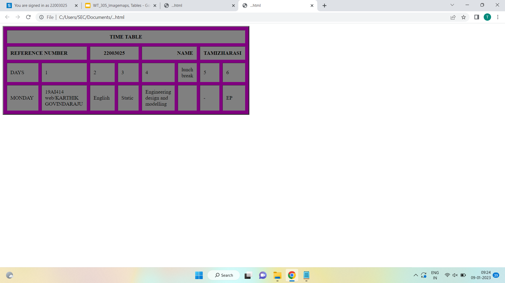

# Experiment_Time_Table

## AIM
To Write a html webpage page to display your timetable.

# ALGORITHM
### STEP 1
create a simple table using table tag
### STEP 2
Add header row using th tag
### STEP 3
Add your timetable
### STEP 4
Execute the program

# CODE
 <TABLE BORDER="3" width="750" bgcolor="purple" cellspacing="10" cellpadding="10"> 
<TR> 
	<TH colspan="8" align="center" bgcolor="grey">TIME TABLE</TH>
</TR>   
<TR> 
    <TH colspan="2" align="left" bgcolor="grey">REFERENCE NUMBER</TH>
    <TH colspan="2" align="center" bgcolor="grey">22003025</TH>
    <TH colspan="2" align="right" bgcolor="grey">NAME</TH>
    <TH colspan="2" align="right" bgcolor="grey">TAMIZHARASI</TH>
</TR>
<TR>
	<TD width="25%"bgcolor="grey">DAYS</TD> 
	<TD width="25%"bgcolor="grey">1</TD>
	<TD width="25%"bgcolor="grey">2</TD>
    <TD width="25%"bgcolor="grey">3</TD>
    <TD width="25%"bgcolor="grey">4</TD>
    <TD width="25%"bgcolor="grey">Lunch break</TD>
    <TD width="25%"bgcolor="grey">5</TD>
    <TD width="25%"bgcolor="grey">6</TD>
</TR>
<TR>
    <TD width="25%"bgcolor="grey">MONDAY</TD>
    <TD width="25%"bgcolor="grey">19AI414</TD>
    <TD width="25%"bgcolor="grey">English</TD>
    <TD width="25%"bgcolor="grey">Static</TD>
    <TD width="25%"bgcolor="grey">Engineering design and modelling</TD>
    <TD width="25%"bgcolor="grey">        </TD>
    <TD width="25%"bgcolor="grey">-</TD>
    <TD width="25%"bgcolor="grey">EP</TD>
</TR>
</TABLE>

# OUPUT:
 